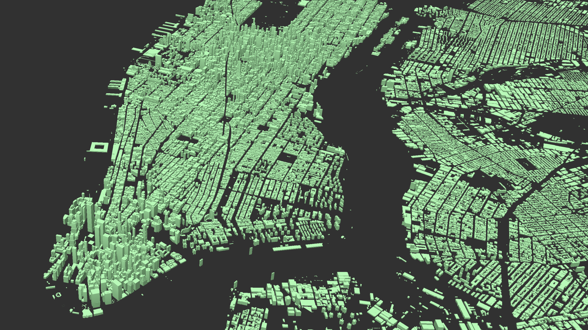
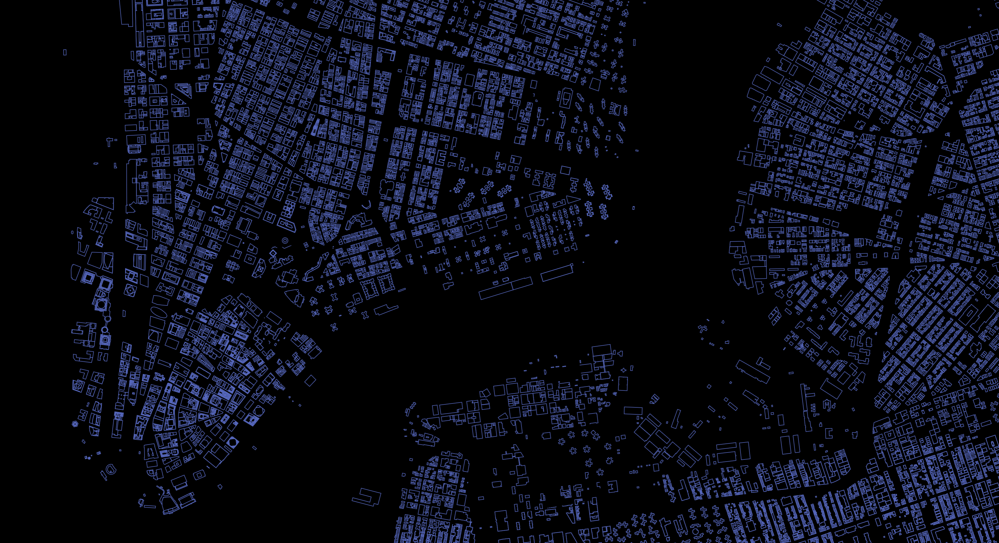

# Data Pipeline for New York Visualization
Collating documentation for data conversion for various layers
The visualization is built on 

## Mapbox-GL Layers
- 3D buildings
- Planimetrics Features
- Terrain Contours
- Surface Temperature
- Heat Risk
- Flood Risk

## Open Map Tiles: 3D buildings



#### *Dataset* :
You can find the Open Map Tiles data [here](https://openmaptiles.org/downloads/#city). Search for New York or use this direct link: [OpenMapTiles.org](https://openmaptiles.os.zhdk.cloud.switch.ch/v3.3/extracts/new-york_new-york.mbtiles). 
To convert .mbtiles to .geojson, use [Tippecanoe-decode](https://github.com/mapbox/tippecanoe#tippecanoe-decode). Geojson can then further be converted to .shp files using [ogr2ogr](http://gis.stackexchange.com/questions/68175/geojson-to-esri-shapefile-using-ogr2ogr)

#### *Description* :
The Open Map Tiles dataset essentially contains building and building part heights, along with common city infrastructure features. Height attributes are useful to reconstruct extruded geometries of the buildings.
The dataset is also made available by [Overpass API](overpass-api.de)

**To use Overpass API instead of Open Map Tiles, follow the steps below:**
- Follow the steps here [UrbanEcologyLab/overpass-api-tiles](https://github.com/UrbanEcologyLab/overpass-api-tiles) to download a OSM tiles and create a geoJSON from them, for a specified bounding box
- To convert the .geoJSON to .mbtiles, use [tippecanoe](https://github.com/mapbox/tippecanoe)

#### *Repository* :
To visualize the dataset refer to [3D-city-buildings](https://github.com/UrbanEcologyLab/3d-city-buildings)

## MapPluto Dataset : City Lots
The modelling was done at lot level. The attributes to be visualized were added to MapPluto Dataset as additional columns.

#### *Description* :
**Layers** *TODO: Add source of datasets*
- Heat Risk:
- Coast Flood Zone: 
-	Elderly Population Density:
- Ethnic Group Distrubution: 

#### *Repository* :
*TODO: Steps taken for Modelling Risks*

--- 	



#### MbTiles Schema

```json
{
  "id": "way/146394788", // Open Map Tile Feature Id
  "height": "43", // Building feature extrude height
  "min_height": 0, // Building feature base of extrusion
  "extrude": true,	// 3D or 2D feature
  "borough": "MN",	// Borough
  "squareTileId": 133,	// Custom Square tile ID for batch processing
  "triangleTileId": 100, // Custom Triangle tile ID for batch processing (Second Pass)
  "BBL": 1009720001,	// MapPluto Unique Lot ID 
  "Block": 972,	// MapPluto Lot ID
  "Lot": 1,	
  "CD": 106,
  "CT2000": "44.01",
  "CB2000": "3009",
  "heat_risk": 0.410707961496, // Heat risk
  "coast_fld": 4,	// Coast flooding zone
  "pop_ov65": 0.0250548164889,	// Elderly Population over 65 years age
  "med_inc": 0.352800803566,	// Median Income
  "tot_pop": 15112,	// Total Population
  "pop_den": 246.357971191,	// Population Density
  "white_pop": 12158,	// White Population
  "white_den": 198.201431274,	// White Population Density
  "afm_pop": 796, // African-American Population
  "afm_den": 12.9765043259, // African-American Population Density
  "hisp_pop": 948, // Hispanic Population
  "hisp_den": 15.4544305801, // Hispanic Population Density
  "asian_pop": 1458,  // Asian Population
  "asian_den": 23.768523160169266, // Asian Population Density
  "major_popDen_grp": "white_den", // Highest Population Density Group
  "major_popDen_val": 198.201431274, // Highest Population Density Group's Value
  "minor_popDen_grp": "afm_den", // Lowest Population Density Group
  "minor_popDen_val": 12.9765043259, // Lowest Population Density Value
  "major_pop_grp": "white_pop", // Highest Population Group
  "major_pop_val": 12158, // Highest Population Group Value
  "minor_pop_grp": "afm_pop", // Lowest Population Group
  "minor_pop_val": 796 // // Lowest Population Group Value
}
```